# Career Ops Workspace · 求职转型作战台

> 一个**单文件、零依赖、离线可用**的个人求职与学习目标管理工作台。
> 拖进浏览器就能用，数据留在你自己的设备上。

> ## ⚠️ 脱敏演示版 · 本站所有信息均为虚构示例
>
> 页面中的人名「**林知远**」、城市、目标薪资、量化数字、学习计划与 JD 数据，**都是为演示这个工具怎么用而编造的示例数据**，
> 不代表作者本人的真实背景。Fork 后请替换为你自己的内容。
> 数据只存在你自己的浏览器 `localStorage` 里，不会上传到任何服务器。

**🔗 在线使用：<https://intp41455.github.io/career-ops-workspace/>**

[](#license)
[](#-快速开始)
[](#-设计约束)
[](https://intp41455.github.io/career-ops-workspace/)

---

## 这是什么

一个为「职业转型期」设计的工作台。把**目标看板 + 学习计划 + 学习资料库 + 投递冲刺清单 + JD 关键词映射 + 无限画布思维导图 + 认知适配策略**收进一个 HTML 文件里。

它不是通用待办 App，而是围绕一个具体问题设计的：

> 一个非科班背景的人，如何在有限时间内把已有的项目经验，翻译成面试官能听懂的技术语言，并补齐真正的硬缺口。

**在线预览**：直接打开 <https://intp41455.github.io/career-ops-workspace/>（GitHub Pages 托管），
或把 `index.html` 拖进浏览器本地运行 —— 两者行为完全一致，数据都存在你自己的浏览器里。

> ⚠️ **本仓库内所有个人信息均为虚构示例**（人物「林知远」、城市、院校、公司、项目量化数字皆为演示数据）。
> 请勿将其当作真实背景资料使用；Fork 后请替换为你自己的内容。（页面顶部亦有同样的可见提示）

---

## ✨ 功能

### 8 个模块

| 模块 | 分组 | 说明 |
|---|---|---|
| **今日要处理** | 执行 | 置顶焦点区。自动聚合逾期 / 今日到期 / 即将到期条目，逾期标红并给一键处理按钮 |
| **目标看板** | 执行 | 四栏拖拽看板（待启动 / 进行中 / 已完成 / 卡住了），按阶段显示进度条 |
| **投递冲刺** | 执行 | 14 天可勾选冲刺清单，每天一个「可拿给人看」的产出物，带进度环与一键重置 |
| **21 天计划** | 执行 | S0–S4 五阶段阶段轴，每阶段含关键动作 + 可验收产出 |
| **学习资料** | 资产 | 精选资料库，按阶段分组，每条附「为什么推荐 + 预计学时 + 优先级」 |
| **JD 映射** | 资产 | 岗位高频关键词 ↔ 你手里的弹药 ↔ 还缺什么，三段式对照，掌握度可轮转标记 |
| **无限画布** | 工具 | 网状思维导图：拖拽平移 / 滚轮缩放 / 节点吸附 / 双击改字；一键生成思维导图、流程图、框图；导出 SVG / PNG |
| **认知配置** | 关于我 | 认知取向 → 执行协议、六维适配度、项目资产盘点、个性化策略与风险提醒 |

### 体验特性

- 🌓 **暗色 / 亮色双主题**，一键切换并记忆
- 📱 **PC / 移动双端适配**，窄屏自动单列、表格转卡片、底部 Tab 可横向滚动
- 🎯 **唯一焦点条**：一屏只给一个动作，减少决策点
- 🔢 **等宽数字**：进度与计数不跳动
- ♿ **无障碍基线**：按钮 ≥44px 点击区，输入框字号 ≥16px（避免 iOS 自动放大）

---

## 🚀 快速开始

```bash
git clone https://github.com/<your-name>/career-ops-workspace.git
cd career-ops-workspace
```

**方式一：直接打开**

双击 `index.html`，或在浏览器地址栏输入：

```
file:///path/to/career-ops-workspace/index.html
```

**方式二：本地静态服务**（推荐，避免个别浏览器对 `file://` 的限制）

```bash
python -m http.server 8000
# 打开 http://localhost:8000
```

**方式三：部署到静态托管**

由于产物只有一个 HTML 文件，可直接上传到任意静态托管（GitHub Pages / Cloudflare Pages / Netlify / Vercel / 对象存储 / Nginx）。无需构建步骤。

本仓库已开启 **GitHub Pages**（源：`main` 分支 `/` 根目录），线上地址：

```
https://intp41455.github.io/career-ops-workspace/
```

Fork 后给自己的仓库开启 Pages 的两种方式：

- **网页操作**：`Settings` → `Pages` → Source 选 `Deploy from a branch` → 分支 `main`、目录 `/` → `Save`
- **命令行**（需 `repo` 权限的 token）：

  ```bash
  gh api repos/{owner}/{repo}/pages -X POST \
    -f 'source[branch]=main' -f 'source[path]=/'
  ```

> 仓库根目录已放置空文件 `.nojekyll`，用于跳过 Jekyll 处理，确保静态资源按原样发布。

> 📱 **手机上使用**：浏览器打开后 → 分享 → 添加到主屏幕，即可当 App 用。

---

## 🧭 界面预览

| 今日要处理 | 目标看板 |
|---|---|
| 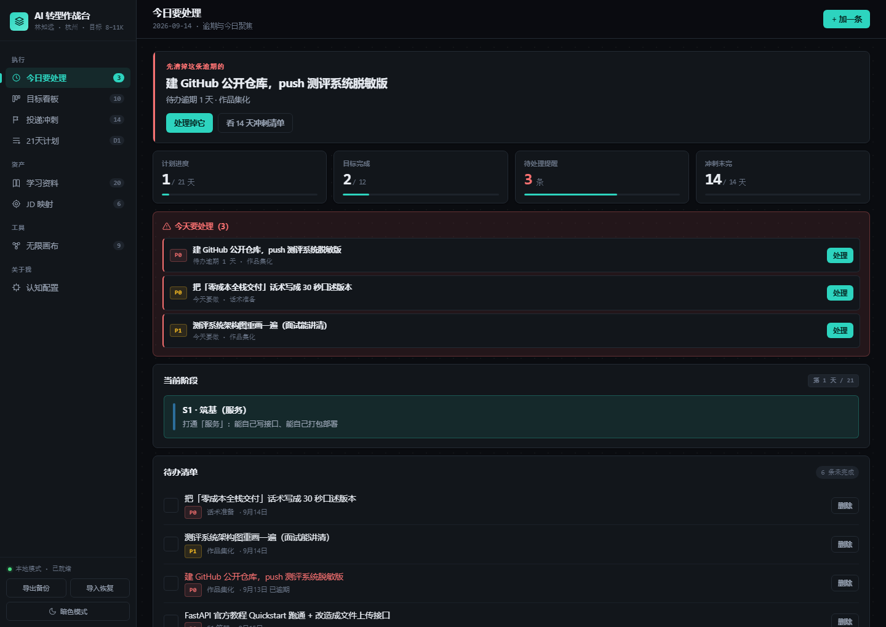 | 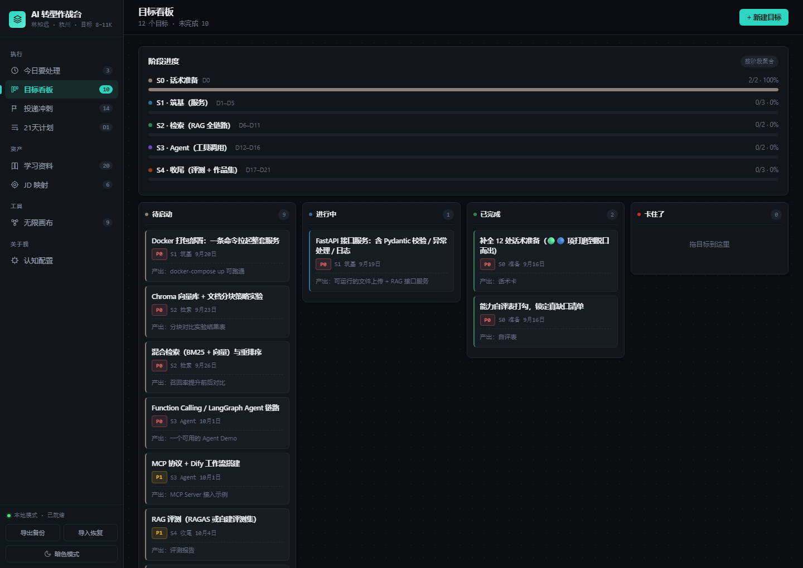 |

| 投递冲刺 | JD 映射 |
|---|---|
| 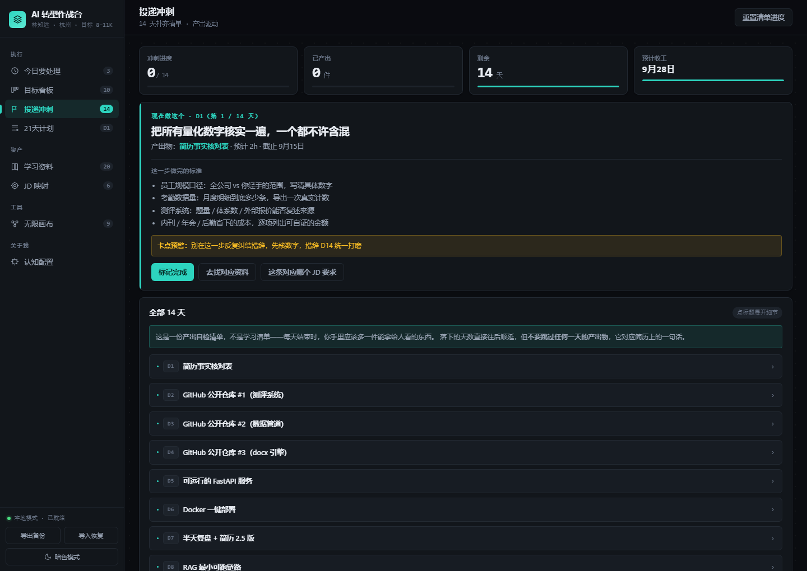 | 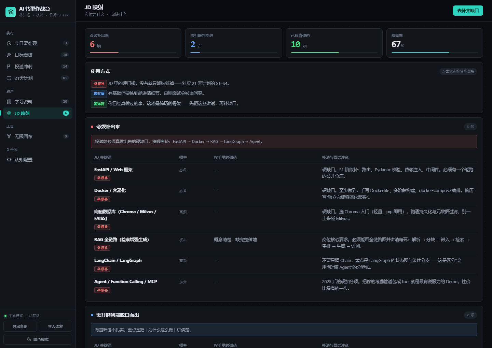 |

| 无限画布（一键生成思维导图） | 认知配置 |
|---|---|
| 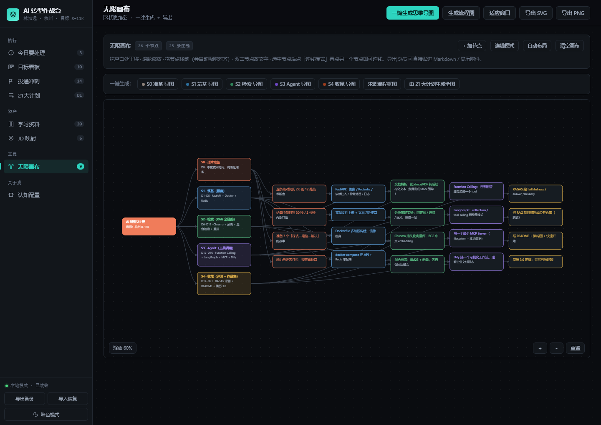 | 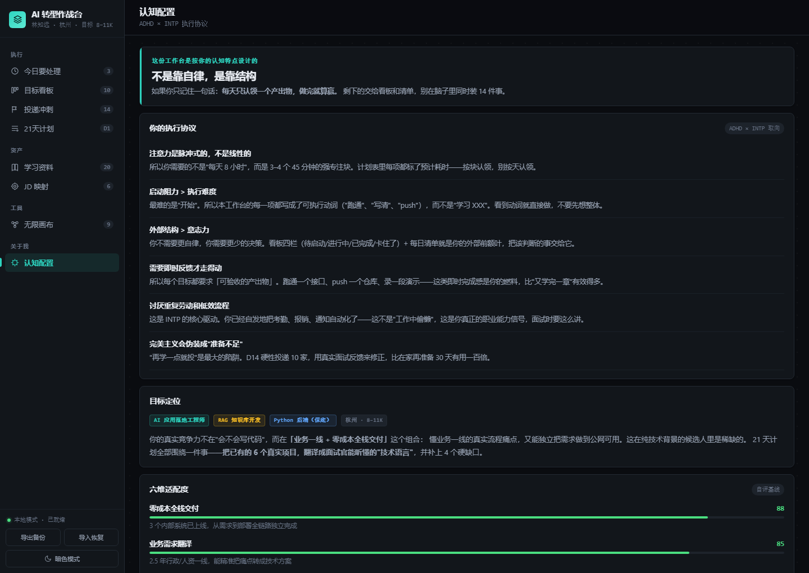 |

| 21 天计划 | 学习资料 |
|---|---|
| 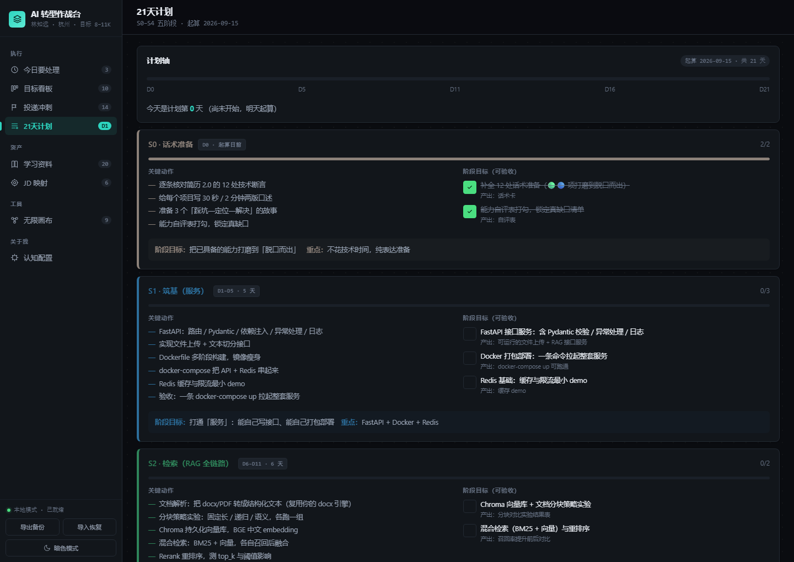 | 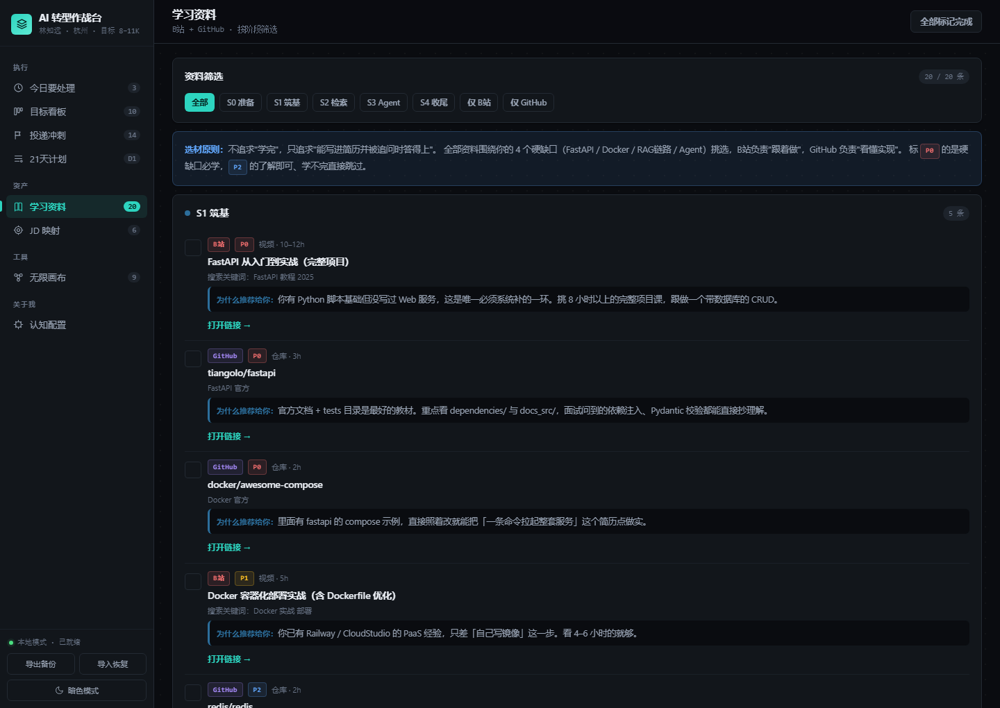 |

| 亮色主题 | 移动端 |
|---|---|
| 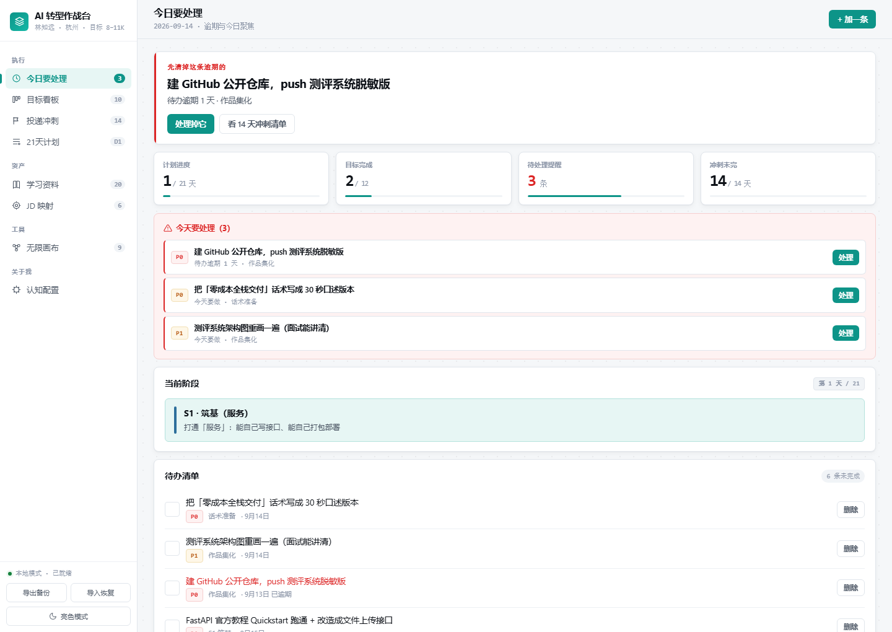 | 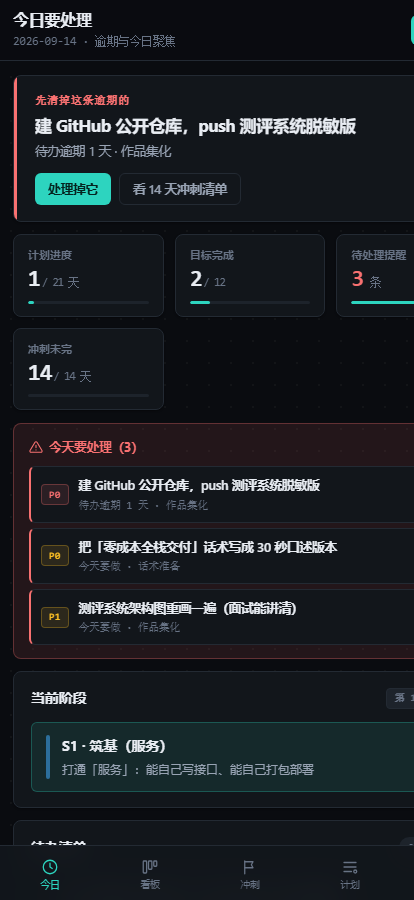 |

---

## 🏗️ 框架与结构

### 分层调用结构（无后端 · 无构建 · 零外部依赖）

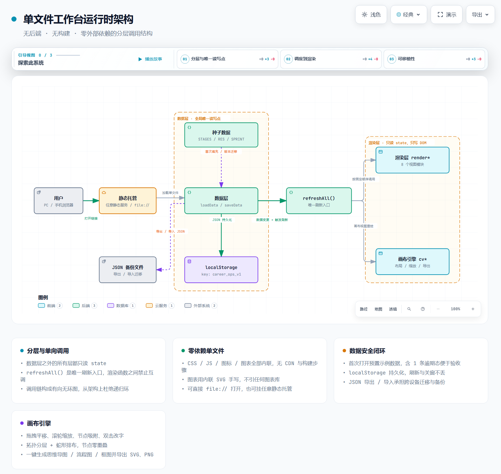

> 可交互版本：[`docs/diagrams/architecture.html`](docs/diagrams/architecture.html)（含主题切换、引导视图、缩放、导出）

### 数据流：从一次点击到落盘

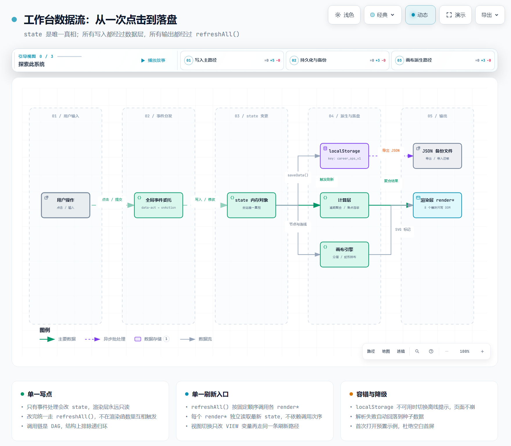

> 可交互版本：[`docs/diagrams/dataflow.html`](docs/diagrams/dataflow.html)

### 使用流程：从打开到导出资产

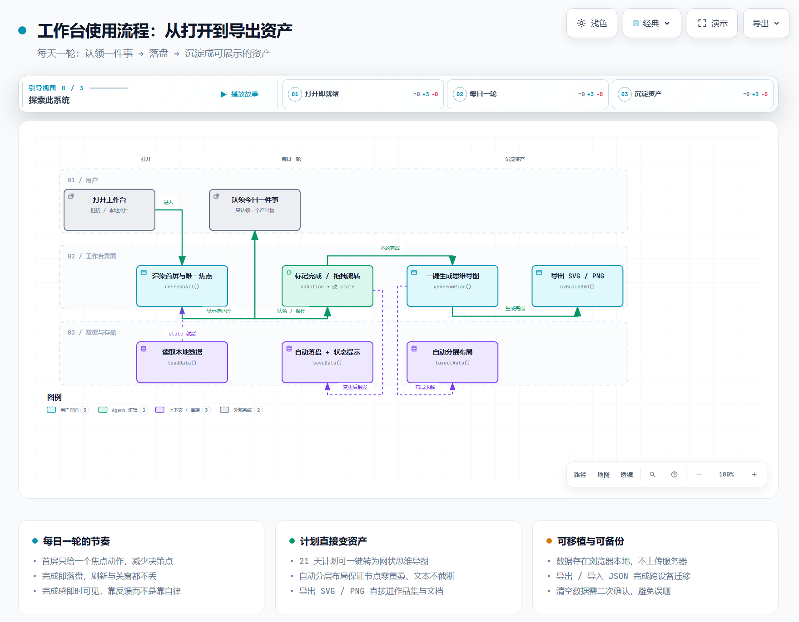

> 可交互版本：[`docs/diagrams/workflow.html`](docs/diagrams/workflow.html)

### 启动与交互时序

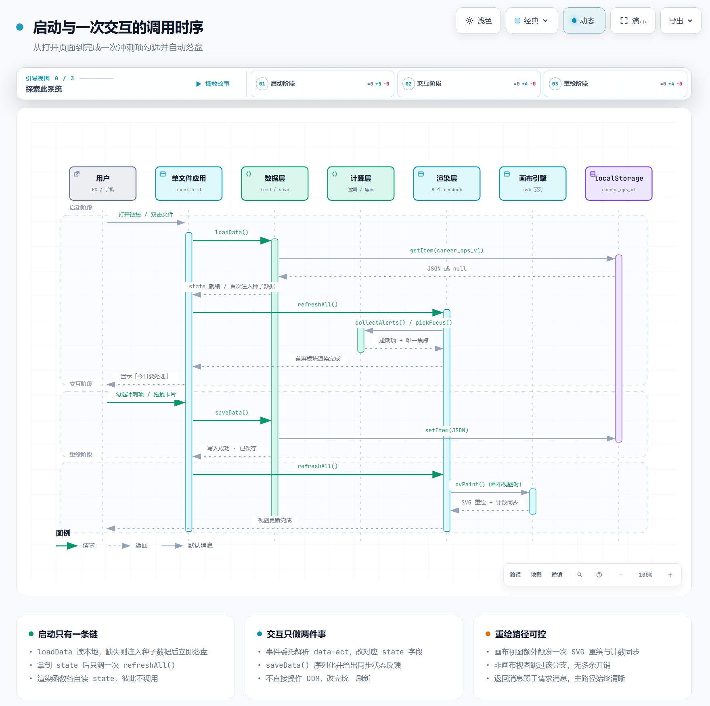

> 可交互版本：[`docs/diagrams/sequence.html`](docs/diagrams/sequence.html)

> 上述 4 张图由 [archify](https://github.com/tt-a1i/archify)（MIT）从 `docs/diagrams/src/*.json` 规格生成，
> 静态 HTML 内联 SVG，可离线打开。图源规格与重生成方式见 [`docs/ARCHITECTURE.md`](docs/ARCHITECTURE.md)。

---

## 📁 目录结构

```
career-ops-workspace/
├── index.html                    # 全部产物：内联 CSS + JS + SVG，单文件零依赖
├── README.md
├── LICENSE                       # MIT
├── .gitignore
└── docs/
    ├── ARCHITECTURE.md           # 分层架构、函数清单、调用链规则
    ├── DATA-MODEL.md             # state 结构与 localStorage 契约
    ├── CUSTOMIZE.md              # 换成你自己的画像 / 计划 / 资料 / 配色
    ├── DESIGN-NOTES.md           # ADHD × INTP 设计取向与取舍记录
    ├── screenshots/              # README 用截图
    └── diagrams/
        ├── architecture.html     # 架构图（可交互）
        ├── dataflow.html         # 数据流图（可交互）
        ├── sequence.html         # 时序图（可交互）
        ├── workflow.html         # 流程图（可交互）
        └── src/*.json            # 图源规格（archify schema）
```

---

## 🔒 数据与隐私

| 项 | 说明 |
|---|---|
| **存储位置** | 浏览器 `localStorage`，key = `career_ops_v1` |
| **是否上传** | ❌ 不上传任何服务器。没有后端、没有埋点、没有统计 |
| **多设备** | 通过左下角「导出备份 / 导入恢复」迁移 JSON 文件 |
| **误删保护** | 清空数据需二次确认 |
| **部署后的边界** | 部署到公网后，**链接本身是公开可访问的**；但数据仍只在你自己的浏览器里 |
| **不要把真实隐私数据预填进页面** | 仓库内示例均为虚构数据；Fork 后请注意不要 commit 真实姓名、薪资、公司内部数据 |

> 「导出备份」按钮在侧边栏底部。数据积累较多时，页面也会温和提醒你导出快照。

---

## 🧱 设计约束

这份代码刻意遵守几条硬约束 —— 它们来自真实踩坑，不是风格偏好：

1. **全内联，零外链**。CSS / JS / 图标 / 图表全部内联；图表用手写 SVG，不引图表库。
   *原因：AI 生成页面时最容易引用外部 CDN，用户只保存了 HTML → 库 404 → 功能全废。*
2. **单文件**。没有构建步骤、没有 `node_modules`、没有依赖。
3. **调用链是 DAG（有向无环图）**。数据层 → 计算层 → 渲染层只允许单向调用；
   所有刷新统一走 `refreshAll()`，**渲染函数之间禁止互调**（否则会出栈溢出）。
4. **首屏非空**。首次打开预置示例数据（含 1 条逾期状态），杜绝空白页。
5. **图标用内联 SVG，不用 emoji**。字体用系统字体栈。
6. **国内财务/涨跌习惯**：支出 / 下跌用红色，收入 / 上涨用绿色；货币符号 `¥`。

---

## 🛠 定制

想把这份工作台改成你自己的？见 [`docs/CUSTOMIZE.md`](docs/CUSTOMIZE.md)，覆盖：

- 换掉虚构画像与目标定位
- 改 21 天计划的阶段划分（`STAGES`）
- 换学习资料库（`RES_SEED`）
- 换投递冲刺清单（`SPRINT_SEED`）与 JD 关键词映射（`JDMAP_SEED`）
- 改认知协议条目（`COGNITION`）
- 换主题色（CSS 变量，暗/亮两套）

> 提示：不想改代码的话，直接在页面上编辑数据 + 导出 JSON 也可以 —— 但下次清空浏览器数据会丢，所以**改完记得导出备份**。

---

## ⁉️ FAQ

**Q：为什么不用 React / Vue？**
A：目标是一个能被任意人双击打开、永久可用的文件。框架会引入构建与依赖，与此目标冲突。

**Q：能多人协作 / 云端同步吗？**
A：当前设计是单用户本地优先。要云端同步需自行接入后端，见 `docs/DATA-MODEL.md` 的扩展点说明。

**Q：画布生成的导图能导入 XMind / 飞书吗？**
A：可导出 **SVG**（矢量，可直接贴进 Markdown / Word / Figma）与 **PNG**（位图）。暂不支持 XMind 专有格式。

**Q：数据会不会因为清缓存丢？**
A：会。`localStorage` 属于浏览器站点数据，清除浏览数据会一并删除。**请定期导出 JSON 备份。**

---

## 📄 License

[MIT](LICENSE) © 2026 contributors

文档中的架构图由 [archify](https://github.com/tt-a1i/archify)（MIT）生成，其自身许可见该项目的 `LICENSE`。
